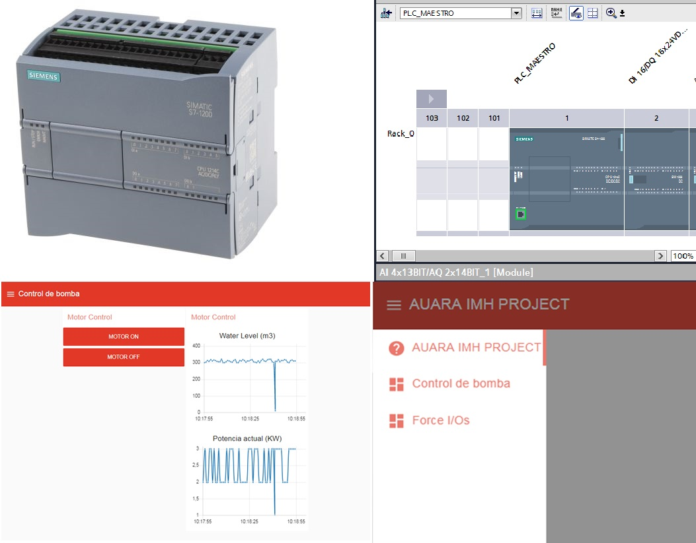

# Auara_project for the development of solar water pumps  (IMH Elgoibar)

700 Million people lack adequate access to safe water. Solar water pumps 
can help, feel free to hack this project.

## Table of Contents

* [Read this first](#read-this-first)
* [Usage](#usage)
  * [License and acknowledgement](#license)
    * [Electrical diagram](#electrical-diagram)
    * [Mechanical 3D design](#mechanical-3d-design)
    * [Lora sensor node](#lora-sensor-node)
	* [Automation SIEMENS PLC](#automation-siemens-plc)
	* [Dashboard](#dashboard)
* [Browser Support](#browser-support)

## Read this first

*In drought-affected areas of Africa, women must walk miles to find water, risking violence or animal 
attack, in order to sustain their families and animals. They do this with the knowledge that the dirty 
water they have collected may well make their children very ill.

Using the overabundance of sunshine,  solar pumps draw water from a 100-meter-deep well, providing 
families with the water that they need and rendering cases of water-related diseases a 
thing of the past.

* If you have an idea for a new feature, **submit your feature
  requests** to the [specification's repository](https://github.com/iarakistain/Auara_project/issues).
  

## Usage

For a more comprehensive reference, refer to
https://www.tactizity.com/auara or you can visit the project log in HACKADAY: https://hackaday.io/project/163079-remote-solar-water-pump

### License and acknowledgement

This project is released as Open Source, with Creative Commons, 
Share Alike license. Feel free to modify and improve it. Commercial
use is not allowed. 

In case you use it, please acknowleded IMH Institute. 

#### Mechanical 3D design

STL design file is included.

#### Electrical diagram

We have used mostly, components from SIEMENS in our design. 

#### LoRa sensor node

The code has been developed for a STM32 microcontroller, using ARDUINO. A T-BEAM board has been used for this purpose. The sketch sends 0-10V sensor data over LoRa every 30 seconds.

#### Automation SIEMENS PLC

We have used a SIEMES S7-1200 PLC. 

#### Dashboard

We have developed this dashboard in TABLEAU. 

## Browser Support

- Chrome
- Firefox
- Safari 6.1+
- Internet Explorer 10+

Note: If you believe you've encountered an error in any of these browsers, you should file
an issue with that browser vendor instead of this project.

  [fetch specification]: https://fetch.spec.whatwg.org
  [cors]: https://developer.mozilla.org/en-US/docs/Web/HTTP/Access_control_CORS
    "Cross-origin resource sharing"
  [csrf]: https://www.owasp.org/index.php/Cross-Site_Request_Forgery_(CSRF)_Prevention_Cheat_Sheet
    "Cross-site request forgery"
  [forbidden header name]: https://developer.mozilla.org/en-US/docs/Glossary/Forbidden_header_name
  [releases]: https://github.com/github/fetch/releases
